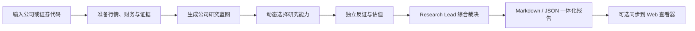

# A+H 股公司研究系统

一个面向 A 股与港股单家公司的可审计研究框架。

它不是通用股票打分器，也不负责给出仓位或自动下单。系统先理解公司如何赚钱、增长从哪里来、市场已经计价了什么，再选择适合这家公司的 KPI、研究周期、可比基准和估值方法，最后输出一份一体化公司研究报告。

## 它能回答什么

- 公司靠什么赚钱，收入、利润、ROIC 和自由现金流由什么驱动？
- 当前增长点是什么，增长处于加速、稳定、放缓还是无法判断？
- 哪些变化已经反映在股价里，市场隐含了怎样的经营预期？
- 这家公司适合 PE、DCF、SOTP、单位经济还是里程碑情景估值？
- 动态安全边际应该是多少，依据是什么？
- 理想买入、可接受买入、合理持有和估值偏贵/卖出复核区间在哪里？
- 哪些风险会破坏 investment thesis，下一次应该监测什么？

## 能力总览

| 模块 | 系统能做什么 | 关键约束 |
|---|---|---|
| A/H 证券识别 | 统一解析上交所、深交所、北交所和港交所代码 | 使用 `600519.SH`、`300750.SZ`、`830799.BJ`、`00700.HK` 等格式 |
| 数据接入 | 支持离线 Demo、严格 JSON 数据文件和 AkShare 适配器 | 数据供应商只提供证据，不直接产生投资结论 |
| 行情与快照 | 获取 A/H 日线、价格变化、最新聚合财务和估值上下文 | AkShare 聚合财务缺少完整历史披露时间，只适合当日研究线索 |
| 时点控制 | 校验 `as_of`、`published_at`、`observed_at` 和 `period_end` | 拒绝未来数据；不把当前快照倒灌进历史研究 |
| 研究蓝图 | 根据商业模式选择研究周期、关键 KPI、研究角色和可比策略 | 不使用固定 Agent 名单、固定因子权重或统一模板 |
| 公司自适应研究 | 覆盖消费品牌、数字平台、资本密集制造、金融资产负债表、研发管线等类型 | 角色为问题服务，没有信息增量的角色不加入 |
| 同业与基准 | 判断是否真正需要同业比较，并筛选有效可比对象 | 独特公司可改用自身历史、单位经济、SOTP 或情景估值 |
| 独立反证 | 主动检查增长质量、会计、治理、周期和估值假设 | 不按人数投票，不用重复辩论制造置信度 |
| 估值与安全边际 | 建立 bull/base/bear 情景、动态安全边际和价格区间 | 缺少正常化盈利、现金流或估值锚时拒绝虚假精确 |
| 市场计价判断 | 分析预期是尚未充分反映、部分反映、大致充分反映还是过度反映 | 需要 reverse valuation、一致预期及价格反应等证据交叉验证 |
| 报告输出 | 输出自然中文 Markdown 与结构化 JSON | 报告按公司问题组织，不展示内部角色流水账 |
| Web 查看器 | 展示观察池、企业质量、估值状态、市场计价和证据缺口 | Web 只查看和保存研究结果，不在页面内生成研究 |
| 工程验证 | 提供模拟成交、跨币种组合和 walk-forward 回测模块 | 与公司研究主流程解耦，不影响最终公司结论 |

## 系统如何工作



1. **确定研究对象与时点**：识别证券、市场和研究截止日期。
2. **准备 evidence packet**：汇总行情、财务、估值线索和可追溯证据。
3. **建立 research blueprint**：识别商业类型、主要矛盾、关键 KPI、研究周期和可比策略。
4. **动态研究与挑战**：按公司选择必要能力，并至少进行一次独立反证。
5. **公司特定估值**：选择合适方法，检查市场隐含预期，计算动态安全边际。
6. **编辑最终报告**：将事实、推断、情景和未知量合并为一份公司问题导向的报告。

## 最终报告包含什么

- 核心结论、主要矛盾和一句话 thesis；
- 企业质量与增长势头；
- 商业模式、盈利引擎和公司特定 KPI；
- 盈利能力、现金流质量和财务变化；
- 增长驱动、兑现程度和未来催化剂；
- 竞争格局与有效可比基准；
- 市场已经计价了什么；
- 估值方法、动态安全边际和价格区间；
- 最强反证、主要风险、thesis invalidation 和监测指标；
- 数据时点、证据边界和来源链接。

企业质量、增长势头、估值状态和市场计价程度会分别判断，不会被压缩成单一 BUY/SELL 分数。

## 推荐入口：在 Codex 中直接研究

仓库内置研究 skill：[`skills/ah-research-team/`](skills/ah-research-team/)。在已经加载该 skill 的 Codex 环境中，可以直接输入：

```text
使用 $ah-research-team 全面研究贵州茅台，重点解释增长点、市场已经计价了多少，以及合理的买入和卖出复核区间。

使用 $ah-research-team 研究腾讯控股。不要机械套互联网同业，先判断哪些业务真正可比，并围绕主要矛盾形成一体化报告。

使用 $ah-research-team 复核我对宁德时代的投资逻辑。重点挑战增长持续性、资本开支回报和当前估值隐含的出货假设。
```

Codex 对话负责研究编排、联网取证和综合判断；本仓库的 Python 包负责确定性的数据准备、时点校验、研究状态和报告渲染。Python 包本身没有 LLM API 依赖。

## CLI 快速开始

### 运行环境

- Python 3.9 或更高版本；
- 使用 AkShare 时需要外网；
- 使用 Web 查看器时需要 Node.js 22.13+ 和 pnpm。

### 安装 Python 包

```bash
python3 -m venv .venv
.venv/bin/python -m pip install --upgrade pip setuptools wheel
.venv/bin/python -m pip install -e '.[akshare]'
```

### 1. 离线 Demo

不访问外网，用于验证完整研究流程、报告结构和价格区间计算：

```bash
PYTHONPATH=src python3 -m ashare_research analyze 600519.SH --provider demo
```

输出 JSON：

```bash
PYTHONPATH=src python3 -m ashare_research analyze 600519.SH --provider demo --json
```

> Demo 中的公司事实和情景价值仅用于工程验证，不代表真实研究结论。

### 2. 获取当前 A/H 市场数据

```bash
.venv/bin/ashare-research analyze 600519.SH --provider akshare
.venv/bin/ashare-research analyze 00700.HK --provider akshare --json
```

AkShare 适配器会尝试准备 A/H 日线、公司资料、最新聚合财务和估值字段，并记录备用数据源的失败与降级信息。它不会自动补齐完整法定披露、分部经营数据或前瞻情景价值。

### 3. 使用自己的 point-in-time 数据

```bash
PYTHONPATH=src python3 -m ashare_research analyze 600519.SH \
  --date 2026-08-18 \
  --data-file examples/research_data.json \
  --save
```

数据契约示例见 [`examples/research_data.json`](examples/research_data.json)。自定义 provider 需要保留来源、披露时间、观察时间、报告期、单位、币种和口径。

### 4. 保存报告

```bash
PYTHONPATH=src python3 -m ashare_research analyze 600519.SH \
  --provider demo \
  --save \
  --output-dir reports
```

系统会同时生成 Markdown 和 JSON。默认输出目录为 `reports/`；研究产物已被 `.gitignore` 排除，避免误提交真实研究数据。

### 常用参数

| 参数 | 作用 |
|---|---|
| `--date YYYY-MM-DD` | 指定研究截止日 |
| `--provider demo\|akshare` | 选择离线样例或 AkShare |
| `--data-file PATH` | 使用符合契约的 JSON 数据 |
| `--json` | 在终端输出 JSON |
| `--save` | 保存 Markdown 与 JSON 报告 |
| `--output-dir PATH` | 覆盖报告目录 |
| `--web-url URL` | 将结果同步到 Web 查看器 |

## Web 报告查看器

```bash
cd web
pnpm install
pnpm run dev
```

打开 `http://localhost:3000`。页面提供：

- A 股与港股观察池；
- 公司研究运行记录；
- 企业质量、估值状态和市场计价展示；
- 证据缺口提示；
- Cloudflare D1 持久化。

将 CLI 研究结果同步到 Web：

```bash
PYTHONPATH=src python3 -m ashare_research analyze 600519.SH \
  --provider demo \
  --web-url http://localhost:3000
```

Web 不展示组合仓位，也不负责生成公司研究。

## 数据与证据纪律

- `as_of` 是研究截止日，只能使用当时已经公开且可获得的信息。
- `published_at` 是材料公开时间，不能晚于研究日。
- `observed_at` 是系统实际获取时间，未来观察会被拒绝。
- `period_end` 是财务所属期间，不能替代披露日期。
- `point_in_time=false` 表示聚合接口缺少可靠披露时点，只能作为当日研究线索。
- 关键数字应回查交易所公告、法定披露或公司 IR；聚合快照不能单独支撑商业模式、增长或内在价值结论。
- 事实、分析推断和情景假设必须分开表达。

## 独立工程模块

这两个模块用于验证交易和回测代码，不参与公司研究结论：

- `PaperPortfolio`：支持 A 股 T+1、港股手数、停牌、涨跌停、交易费用、跨币种换算和最大单一权重约束。
- `BacktestEngine`：执行 walk-forward 调仓并计算累计收益、年化收益、波动率、Sharpe、最大回撤和换手率。

## 明确不做的事情

- 不把 LLM 生成的数字当作数据源；
- 不用当前财务快照回填历史研究；
- 不用单期同比直接判断增长加速或减速；
- 不强制每家公司做同业比较；
- 不对所有公司套用统一 PE/PB 阈值；
- 不把企业质量、增长、估值和价格动作折成一个总分；
- 不输出目标仓位、调仓比例、组合集中度或订单计划；
- 不自动下单。

## 项目结构

```text
.
├── skills/ah-research-team/   # Codex 公司研究 skill
├── src/ashare_research/       # Python 核心包
│   ├── agents/                # 研究规划、分析、估值与综合
│   ├── data/                  # Demo、JSON、AkShare 数据适配器
│   ├── workflow.py            # 研究编排
│   ├── report.py              # Markdown / JSON 报告
│   ├── portfolio.py           # 模拟组合
│   └── backtest.py            # Walk-forward 回测
├── web/                       # 可选 Web 报告查看器
├── examples/                  # 数据契约与运行示例
├── tests/                     # Python 与 Web 测试
├── docs/                      # 架构和产品范围
└── reports/                   # 本地报告输出目录
```

## 验证

Python：

```bash
PYTHONDONTWRITEBYTECODE=1 PYTHONPATH=src python3 -m unittest discover -s tests -v
```

Web：

```bash
cd web
pnpm run lint
pnpm test
```

## 进一步阅读

- [系统架构](docs/architecture.md)
- [当前产品范围与数据路线](docs/product_scope.md)
- [研究团队工作流](skills/ah-research-team/references/team-workflow.md)
- [报告契约](skills/ah-research-team/references/report-contract.md)
- [数据源规则](skills/ah-research-team/references/data-sources.md)

## License

[Apache License 2.0](LICENSE)

> 本项目仅用于公司研究与工程验证，不构成投资建议。
